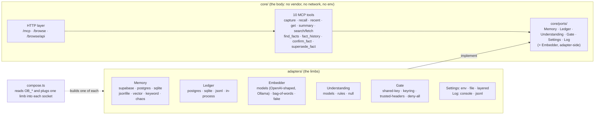
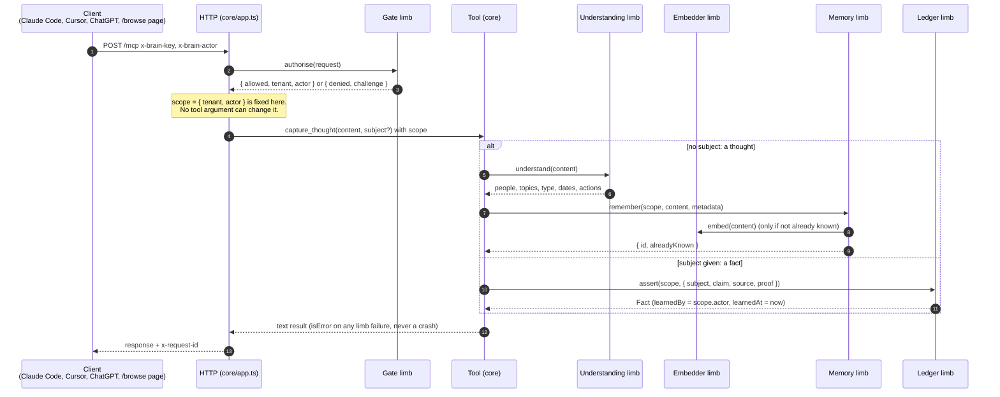
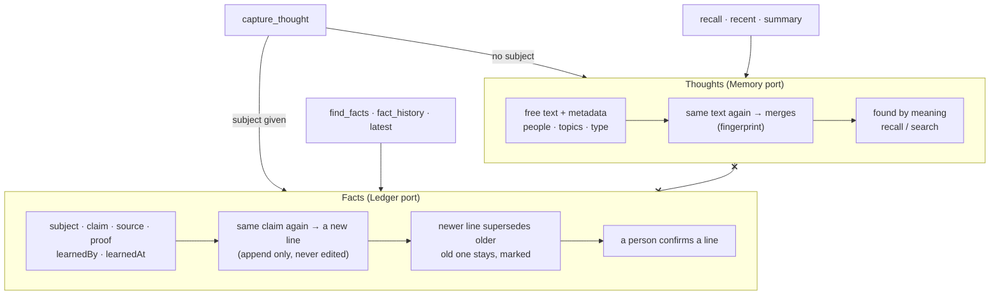
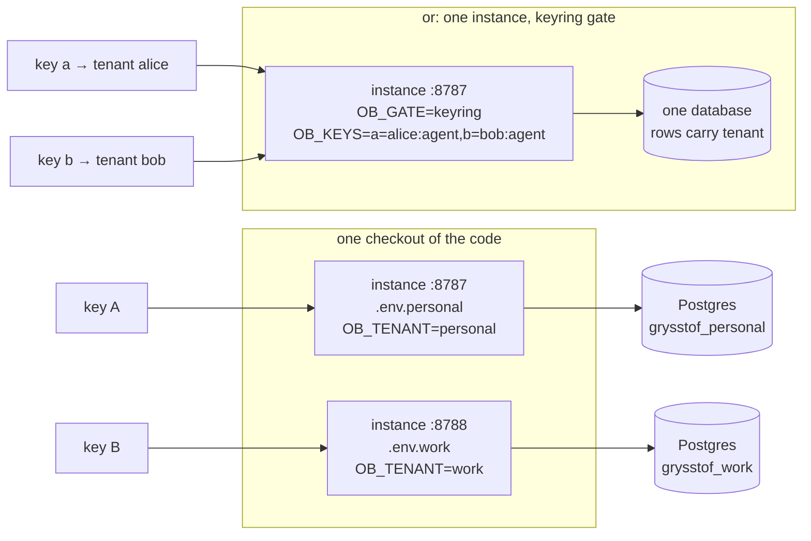
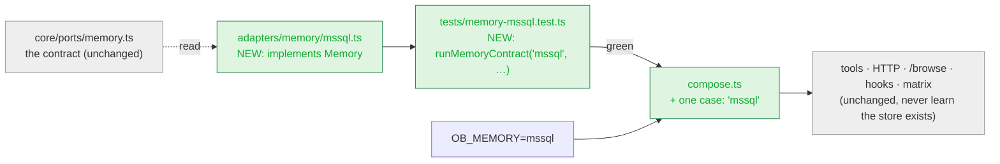

# How Grysstof fits together

Five pictures. Names in the boxes are the names in the code. The written contracts behind each socket, and how to add a limb, are in [`LIMBS.md`](LIMBS.md).

## 1. The body and its sockets

The body never touches the outside world. Everything it needs comes in through seven sockets; a limb fills each one.

`tests/architecture.test.ts` fails the build if anything in `core/` imports an adapter, a vendor SDK, `fetch` or `Deno.env`.

## 2. One request, end to end

Where the tenant and the actor come from, and why a tool argument can never override them.

## 3. A fact is not a thought

Two stores, two sets of rules, no leakage between them.

`tests/app.e2e.test.ts` pins that nothing asserted as a fact ever appears in `recall`, `recent` or `summary`.

## 4. Tenants: one checkout, many memories

The gate decides the tenant; the limbs partition by it; the same code serves as many instances as you start.

`compose.ts` refuses to pair a memory that cannot partition (`isolation: "none"`) with a gate that admits many tenants.

## 5. Plugging in something new

What changes when you add a store the project has never seen. Everything grey stays exactly as it is.

Three files touched, one of them a one-line `case`. The matrix (`deno task matrix`) then proves the new row answers the same transcript byte for byte as the in-memory row.
